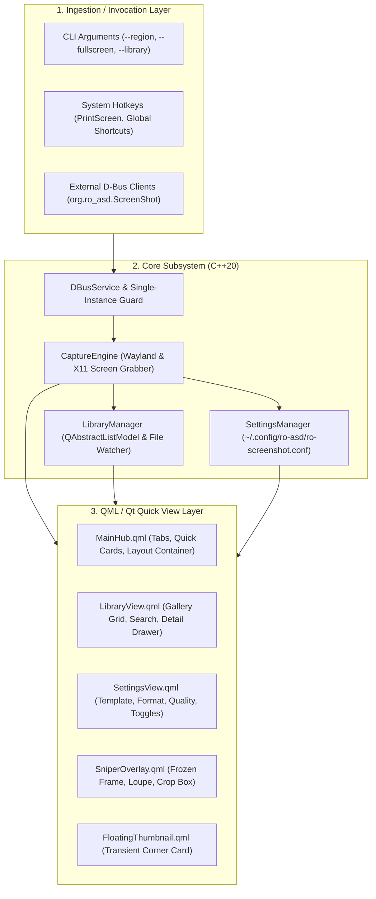

# Ro-ScreenShot Architecture Specification

This document details the software architecture, data structures, subsystem interactions, and IPC boundaries of **Ro-ScreenShot**.

---

## 🏛️ 1. High-Level Architecture Overview

Ro-ScreenShot is engineered in **C++20** and **Qt 6.11** following a clean, decoupled service architecture:

---

## 📂 2. Core Modules Breakdown

### 2.1. `CaptureEngine` (`src/core/CaptureEngine.hpp`)
- **Multi-Monitor Geometry Stitching:** Queries `QGuiApplication::screens()` to calculate the virtual bounding rectangle across all monitors and composits them into a single `QImage` framebuffer.
- **Frozen Frame Pipeline:** Saves the captured framebuffer to `.cache/ro-asd/ro-screenshot/frozen_frame.png` and triggers the `SniperOverlay` window.
- **Cropping & Serialization:** Crops normalized sub-rectangles upon user confirmation and serializes to disk using selected format (`PNG`, `JPEG`, `WebP`) with compression quality profiles.
- **Clipboard Pipe:** Offers native `QClipboard::setImage()` to ensure instant paste into chat apps, browsers, and image editors.

### 2.2. `SettingsManager` (`src/core/SettingsManager.hpp`)
- Backed by standard `QSettings` INI format at `~/.config/ro-asd/ro-screenshot.conf`.
- **Dynamic Template Engine:** Expands `%Y`, `%y`, `%m`, `%d`, `%H`, `%M`, `%S`, `%ms` tokens in real-time with live preview.
- **Workflow Control:** Manages auto-copy, auto-save, floating thumbnail visibility, notification sounds, month-based folder grouping, and magnifier settings.

### 2.3. `LibraryManager` (`src/core/LibraryManager.hpp`)
- Inherits `QAbstractListModel` for zero-overhead data binding in QML `GridView`.
- **Live File Watcher:** Uses `QFileSystemWatcher` to automatically refresh the gallery whenever files are added or deleted by external file managers (Dolphin, Nautilus).
- **Asynchronous Thumbnail Cache:** Generates and stores 320x240 thumbnails under `~/.cache/ro-asd/ro-screenshot/thumbnails/<md5_hash>.png` to ensure 4K/60FPS smooth scrolling across hundreds of screenshots.

### 2.4. `DBusService` (`src/core/DBusService.hpp`)
- Registers on the D-Bus session bus at `org.ro_asd.ScreenShot`.
- Enforces a strict single-instance paradigm: if an instance is already running, new CLI commands route their request to the active process via D-Bus and exit immediately.

---

## ⚡ 3. D-Bus Interface Specification

- **Service Name:** `org.ro_asd.ScreenShot`
- **Object Path:** `/org/ro_asd/ScreenShot`
- **Interface:** `org.ro_asd.ScreenShot`

### Methods:
| Method | Parameters | Description |
| :--- | :--- | :--- |
| `CaptureRegion` | `int delaySeconds` | Freezes display and opens interactive Sniper overlay |
| `CaptureFullscreen` | `int delaySeconds` | Captures entire desktop immediately |
| `CaptureWindow` | `int delaySeconds` | Captures active window/screen |
| `OpenLibrary` | None | Shows and raises the Main Hub on the Library tab |
| `OpenSettings` | None | Shows and raises the Main Hub on the Settings tab |
| `Quit` | None | Gracefully shuts down the background application |

---

## 🔒 4. Storage & File System Standards

| Category | Path | Purpose |
| :--- | :--- | :--- |
| **Captures** | `~/Pictures/Screenshots/` | Default location for saved images |
| **Config** | `~/.config/ro-asd/ro-screenshot.conf` | User settings & preferences |
| **Cache** | `~/.cache/ro-asd/ro-screenshot/thumbnails/` | Cached 320x240 gallery preview thumbnails |
| **Temp Frame** | `~/.cache/ro-asd/ro-screenshot/frozen_frame.png` | Ephemeral frame used by Sniper overlay |
